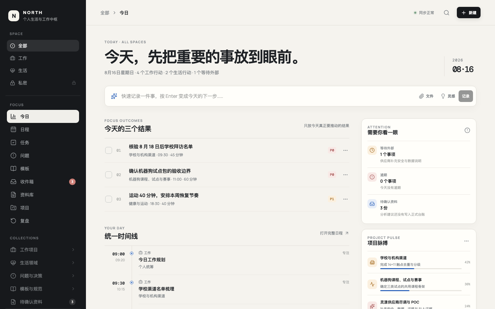

<p align="center">
  <a href="https://github.com/wenxuanzhang1209-cyber/personal-life-hub/actions/workflows/ci.yml"></a>
  
  
  
</p>

# NORTH · Personal Life & Work Hub

**One timeline for work, life, and private notes — with boundaries so they don't bleed into each other.**

<sub>把工作、生活和私密记录放在同一条时间线上，同时用空间边界避免互相干扰。</sub>



---

## Why this exists

Most personal tools force a choice: one app for work, another for life, a third for anything
private. So the same afternoon gets split across three places, and the question "what is
actually happening this week?" has no single answer.

Merging everything into one list has the opposite problem — a therapy appointment sitting
between two client deliverables is not a productivity feature.

NORTH keeps one timeline and adds **space boundaries**: work, life, and private are separate
lenses over the same data, not separate apps. You see the whole week when you want to, and
only one part of it when someone is looking over your shoulder.

<sub>大多数个人工具逼你二选一：工作一个应用、生活另一个、私密的再来一个——
于是同一个下午被拆到三个地方，"这周到底在发生什么"没有一个统一答案。
而全部合成一条列表又是另一种问题：一个私人预约夹在两个客户交付之间，
那不叫效率。NORTH 用**空间边界**解决：工作、生活、私密是同一份数据上的不同视角。</sub>

## What it does

| View | What it holds |
|---|---|
| **Timeline** | Work / life / private entries on one axis, filtered by space |
| **Tasks** | Status flow, priority, due date, project context |
| **Projects** | Grouping, risk flags, overdue surfacing |
| **Questions & decisions** | Open questions, waiting-on-others, decision records with evidence |
| **Inbox** | Capture first, file later — with a "material never became an action" check |
| **Materials** | Reference notes attached to projects |
| **Templates** | Reusable structures for recurring work |
| **Reviews** | Retrospectives tied to the period they cover |
| **Search** | Across every view |

Two details that came from actually using it: a **"waiting on someone" state that gets flagged
when it goes stale**, and a check for **material that was saved but never turned into an
action** — the two ways a personal system quietly stops being true.

## Privacy

Everything lives in your browser's `localStorage`. No account, no server, no sync service,
no telemetry. Export and import as JSON when you want a backup or a move.

That is also the honest limitation: **clearing site data deletes your data.** Export before
you clean up a browser.

<sub>全部数据存在浏览器 `localStorage`：无账号、无服务器、无同步、无遥测，
可导出/导入 JSON。诚实的另一面：**清除站点数据会清掉你的数据**，清理浏览器前先导出。</sub>

## Quick start

```bash
npm install
npm run dev        # http://localhost:5173
npm run build
```

CI runs on Node 20.

## Status

Single-file React application (~840 lines) with CI on every push. It does what is listed
above and nothing more — small on purpose. Issues and pull requests welcome.

<sub>单文件 React 应用（约 840 行），每次推送跑 CI。功能就是上面列的那些，
刻意保持小。欢迎 Issue 与 PR。</sub>

## License

[MIT](LICENSE) © 2026 JKinco

---

<sub>
<b>JKinco</b> — local-first tools for work whose data cannot leave the building ·
<a href="https://github.com/wenxuanzhang1209-cyber/jkinco-listen-open">Listen</a> ·
<a href="https://github.com/wenxuanzhang1209-cyber/jkinco-slides">Slides</a> ·
<a href="https://github.com/wenxuanzhang1209-cyber/JKinco-Skills-Lab">Skills Lab</a> ·
<a href="https://github.com/wenxuanzhang1209-cyber/personal-life-hub">Life Hub</a> ·
<a href="https://github.com/wenxuanzhang1209-cyber/jkinco-tools">Tools</a>
</sub>
